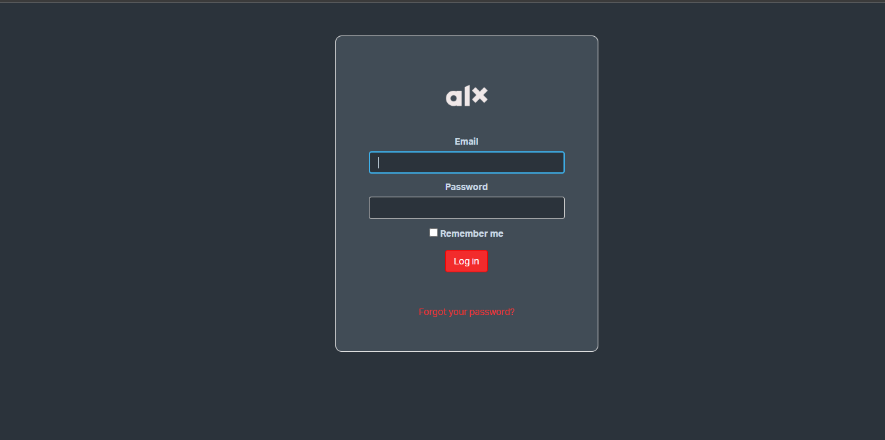

# alx-intranet-dark
Simple chrome extension for dark mode support for ALX intranet.

You might be wondering why I decides to write my own extension
since there are countless extensions
that do the exact same thing.
First of all I didn't like them because when using those extensions some elements seem off.

Second, it is a good experience and a chance to learn something new.

> P.S. If you think the dark mode looks similar to GitHub's. It's because it is. I used GitHub's main dark color.

### Usage

Currently, this extension is still in development
(am experimenting and trying to perfect it).
So to test this extension follow the following steps:

1. Clone this repo `git clone https://github.com/ashenafiDL/alx-intranet-dark.git`

2. Open your browser and type the following into your search bar
to open extensions page and enable Developer mode.

    - for Google Chrome `chrome://extensions/`
    - for Microsoft Edge `edge://extensions/`

3. Click on load unpack and select the location
where you cloned the repo

4. Enjoy the dark side. :)

### Contribution

Your feedbacks are very welcome. If you also want to contribute create an [issue](https://github.com/ashenafiDL/alx-intranet-dark/issues) or submit a PR.

### Todo

- fix this [issue](https://github.com/ashenafiDL/alx-intranet-dark/issues/1)
- add logo
- syntax highlighting (may be)